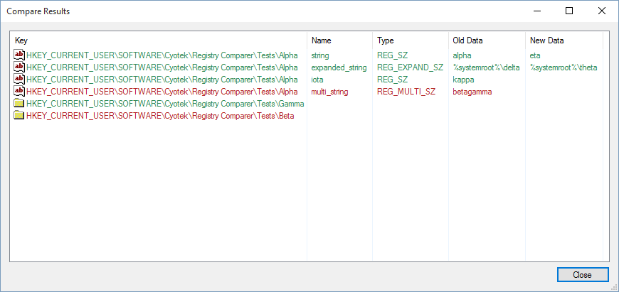
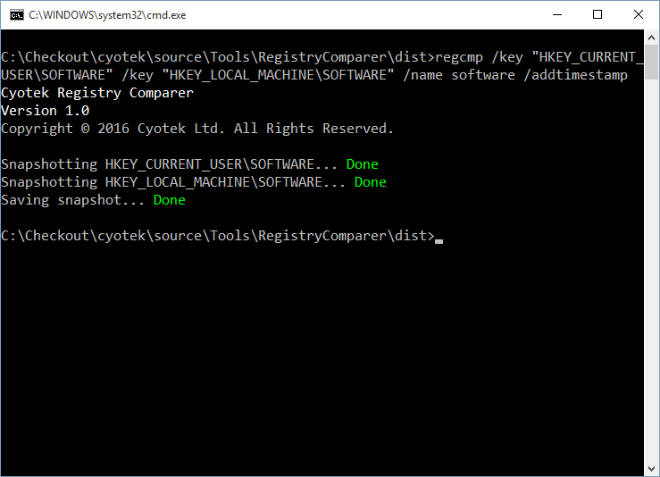

Cyotek Registry Comparer
========================

A simple tool to capture snapshots of the state of one more registry keys, then compare them for differences. Includes both an easy to use GUI and CLI clients.

Clients
-------

* `regcmp.exe` - This is a console based command line client, useful for automated testing and scripting scenarios
* `regcmpui.exe` - This is a GUI that allows easy collection, viewing and comparing of snapshots

Command Line Client
-------------------

### Arguments

The command line client supports the following arguments

| Argument      | Description                                                          |
| ------------- | -------------------------------------------------------------------- |
| /nologo       | Do not display the startup banner and copyright message.             |  
| /key          | The full name of a key to snapshot. Can be specified multiple times. |  
| /name         | The name of the snapshot, and used as the output file name.          |  
| /addtimestamp | Adds the current date and time to the snapshot name.                 |  

Arguments without names are treat as input files for comparisons.

All input and output paths are relative to the startup directory.

### Exit Codes

| Code  | Description                            |
| ----- | -------------------------------------- |
| 0     | Success |                              |
| 1     | Invalid parameters                     |
| 2     | A compare operation found differences  |
| 255   | The program failed with an error       |

### Examples

> A selection of sample snapshots can be found in the `snapshots` folder of this repository

#### Taking a snapshot

This example creates a snapshot named `software` and containing the `HKEY_CURRENT_USER\SOFTWARE` and `HKEY_LOCAL_MACHINE\SOFTWARE` keys. The name will also have the current date and time appended to it.

    regcmp.exe /key "HKEY_CURRENT_USER\SOFTWARE" /key "HKEY_LOCAL_MACHINE\SOFTWARE" /name software /addtimestamp
    
#### Comparing a snapshot

This example will compare the snapshot `test_delsubkey.rge` against `test_base.rge`

    regcmp.exe test_delsubkey.rge test_base.rge
    
Screenshots
-----------

Compare a pair of snapshots using the CLI tool

Comparing the same snapshots using the GUI tool

Capturing a new snapshot using the CLI tool

Viewing a snapshot using the GUI tool